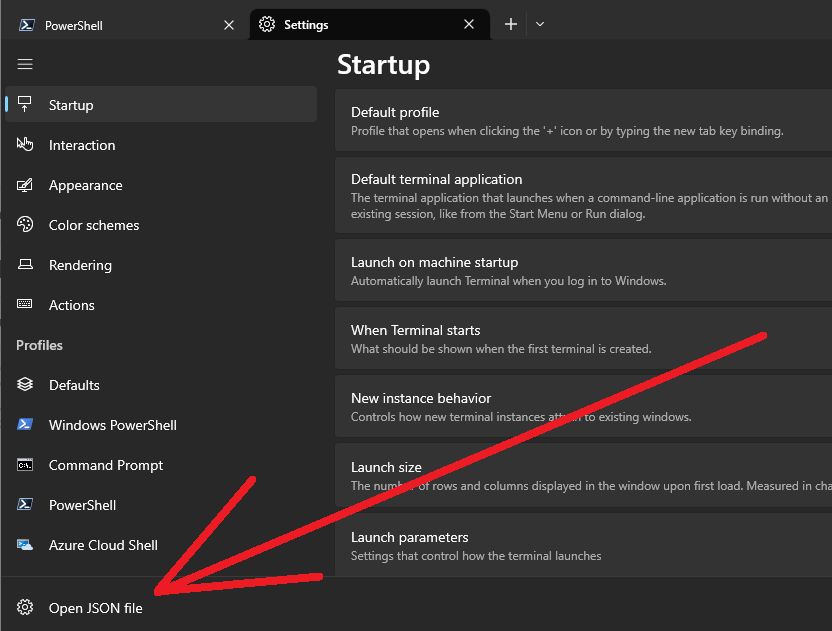
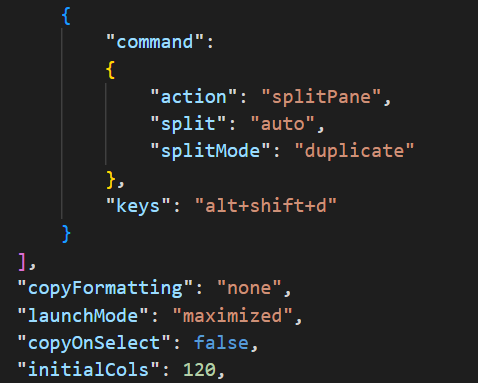

# Useful [Windows Terminal](https://apps.microsoft.com/store/detail/windows-terminal/9N0DX20HK701) bits:

#### Question: Where in tarnation is the settings.json file for Windows Terminal (so I can add some sweet customization)?
Two Approaches:
1. Via Windows Terminal:  Load Windows Terminal. Open Settings (via dropdown 'v' or pressing `ctrl+,`), then in the ***very*** bottom left corner of the Settings window, click "Open JSON file". 
 

2. Directly Access:  The settings.json file is located at
`C:\Users\{USERNAME}\AppData\Local\Packages\Microsoft.WindowsTerminal_8wekyb3d8bbwe\LocalState`

---
#### Feature: I want to always have *windows terminal* **Maximized** when I run it via the right-click context menu.
We need to edit the Window Terminal's settings.json file. So
1. Open the Windows Terminal settings.json (in your favorite editor)
2. Add the following line to settings.json: `"launchMode": "maximized",`  (see following image for example). 

 

Extra: If you want windows terminal to run in fullscreen mode, replace step 2. above with `"launchMode":"fullscreen"`

---

#### Feature: I want a custom hotkey to launch Windows Terminal
Well, the only way I was able to do it was to write an autohotkey script; please see this directory for said file.

---

#### Interest: I would like to learn more about Windows Terminal regarding customization and themes.
Follow this [Link](https://learn.microsoft.com/en-us/windows/terminal/) 

---

All this jazz has only been played on Windows 10.

